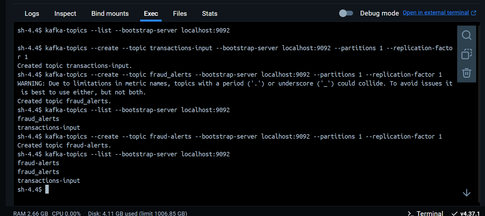
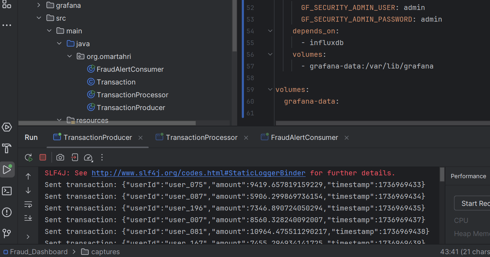
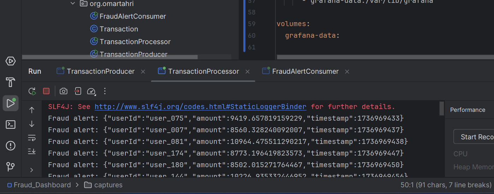
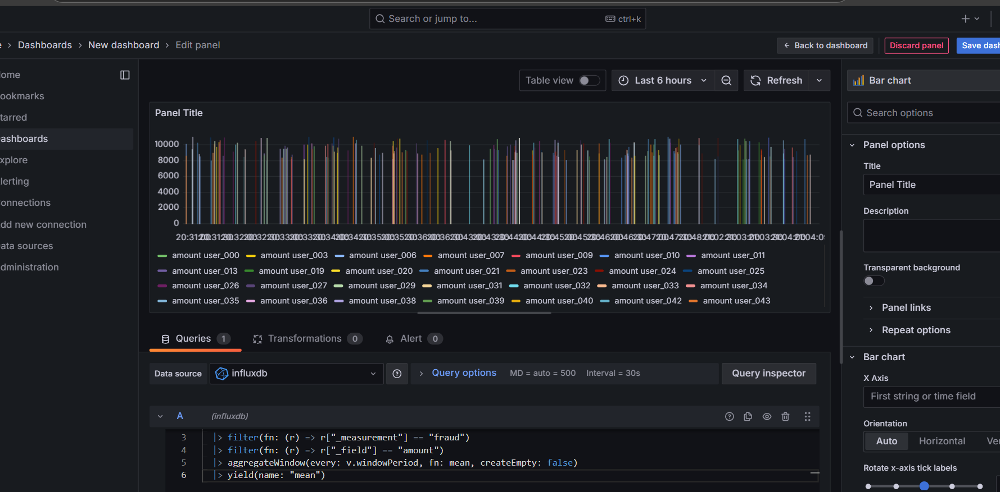

# Détection de Fraudes avec Kafka Streams

Ce projet a pour objectif de mettre en place une solution de détection de transactions financières suspectes en temps réel, en s'appuyant sur la technologie Kafka Streams. Les données identifiées comme frauduleuses sont ensuite conservées dans une base de données, et l'ensemble des informations sont visualisées via un tableau de bord Grafana.

## Architecture

Le système est conçu pour analyser les transactions en continu. Il lit les informations à partir du topic Kafka nommé `transactions-input`. Ensuite, une logique de détection de fraude est appliquée. Dans cette version, elle consiste à identifier les transactions dont le montant dépasse 10 000.

Pour la configuration du pipeline Kafka Streams, plusieurs aspects sont importants. Les données brutes des transactions sont acheminées vers le topic `transactions-input`. Les transactions identifiées comme suspectes sont envoyées vers le topic `fraud-alerts`. Kafka Streams agit comme le cœur du processus, en appliquant les règles de détection et en publiant les résultats.

Afin de pouvoir persister les transactions suspectes, InfluxDB est utilisé. Cette base de données temporelle est idéale pour enregistrer les informations en temps réel.

Enfin, un tableau de bord interactif Grafana est mis en place pour visualiser les informations. Ce tableau de bord permet de suivre le nombre de transactions suspectes par utilisateur et le montant total des transactions suspectes sur une période donnée. Les graphiques du tableau de bord se mettent à jour automatiquement, offrant une vue en temps réel de l'activité frauduleuse.

Le déploiement est simplifié grâce à l'utilisation de Docker Compose, qui permet de lancer facilement Kafka et InfluxDB et Grafana.

---

## Setup du cluster Kafka

Un cluster Kafka est composé d'un seul broker Kafka, avec Zookeeper servant de gestionnaire de cluster. Un fichier docker-compose.yaml est utilisé pour démarrer le cluster.

```yaml
version: "3.8"
networks:
  monitoring:
    driver: bridge
services:
  zookeeper:
    image: confluentinc/cp-zookeeper:latest
    networks:
      - monitoring
    environment:
      ZOOKEEPER_CLIENT_PORT: 2181
    ports:
      - "2181:2181"

  kafka:
    image: confluentinc/cp-kafka:latest
    networks:
      - monitoring
    depends_on:
      - zookeeper
    ports:
      - "9092:9092"
    environment:
      KAFKA_BROKER_ID: 1
      KAFKA_ZOOKEEPER_CONNECT: zookeeper:2181
      KAFKA_ADVERTISED_LISTENERS: PLAINTEXT://kafka:29092,PLAINTEXT_HOST://localhost:9092
      KAFKA_LISTENER_SECURITY_PROTOCOL_MAP: PLAINTEXT:PLAINTEXT,PLAINTEXT_HOST:PLAINTEXT
      KAFKA_INTER_BROKER_LISTENER_NAME: PLAINTEXT
      KAFKA_OFFSETS_TOPIC_REPLICATION_FACTOR: 1

  influxdb:
    image: influxdb:latest
    networks:
      - monitoring
    ports:
      - "8086:8086"
    environment:
      DOCKER_INFLUXDB_INIT_MODE: setup
      DOCKER_INFLUXDB_INIT_USERNAME: admin
      DOCKER_INFLUXDB_INIT_PASSWORD: adminpassword
      DOCKER_INFLUXDB_INIT_ORG: enset
      DOCKER_INFLUXDB_INIT_BUCKET: fraud_transaction
      DOCKER_INFLUXDB_INIT_ADMIN_TOKEN: my-super-secret-token

  grafana:
    image: grafana/grafana:latest
    networks:
      - monitoring
    ports:
      - "3000:3000"
    environment:
      GF_SECURITY_ADMIN_USER: admin
      GF_SECURITY_ADMIN_PASSWORD: admin
    depends_on:
      - influxdb
    volumes:
      - grafana-data:/var/lib/grafana

volumes:
  grafana-data:
```

Ce fichier docker-compose.yml simplifie le déploiement d'une stack de monitoring complète. En exécutant simplement la commande docker-compose up, tous les services nécessaires seront automatiquement démarrés. Les principaux composants incluent Zookeeper pour la gestion des clusters Kafka, Kafka pour le traitement des messages, InfluxDB pour le stockage des séries temporelles, et Grafana pour la visualisation des données. Les services sont connectés via un réseau Docker dédié (monitoring) et les données de Grafana sont sauvegardées de manière persistante dans un volume Docker. Aucune configuration manuelle supplémentaire n’est requise, tout est préconfiguré pour un démarrage rapide.

## Réalisation

### 1- Class Transaction

```java
package ma.enset;

import com.fasterxml.jackson.annotation.JsonProperty;

public class Transaction {
    private String userId;
    private double amount;
    private int timestamp;

    public Transaction() {}

    public Transaction(String userId, double amount, int timestamp) {
        this.userId = userId;
        this.amount = amount;
        this.timestamp = timestamp;
    }

    @JsonProperty("userId")
    public String getUserId() {
        return userId;
    }

    @JsonProperty("amount")
    public double getAmount() {
        return amount;
    }

    @JsonProperty("timestamp")
    public int getTimestamp() {
        return timestamp;
    }

    @Override
    public String toString() {
        return "Transaction{" +
                "userId='" + userId + '\'' +
                ", amount=" + amount +
                ", timestamp=" + timestamp +
                '}';
    }
}
```

Cette classe Java, située dans le package ma.enset, représente une transaction financière à travers trois attributs : userId (identifiant de l'utilisateur), amount (montant de la transaction) et timestamp (horodatage de la transaction). Elle est conçue pour être utilisée dans des applications nécessitant le traitement ou l'échange de données liées aux transactions, notamment via JSON.

Les annotations Jackson (@JsonProperty) permettent une sérialisation et une désérialisation simplifiées des objets, ce qui est essentiel pour les échanges entre services ou avec des bases de données. La classe propose un constructeur par défaut, un constructeur paramétré, ainsi qu’une méthode toString pour un affichage lisible des détails de la transaction, utile pour la journalisation ou le débogage. Cette implémentation assure une manipulation claire et efficace des données transactionnelles.

### 2- Class TransactionProducer

```java
package ma.enset;
import com.fasterxml.jackson.databind.ObjectMapper;
import org.apache.kafka.clients.producer.KafkaProducer;
import org.apache.kafka.clients.producer.ProducerConfig;
import org.apache.kafka.clients.producer.ProducerRecord;
import org.apache.kafka.common.serialization.StringSerializer;
import java.util.Properties;
import java.util.Random;
public class TransactionProducer {
    private static final String TOPIC = "transactions-input";
    private static final Random RANDOM = new Random();
    private static final ObjectMapper MAPPER = new ObjectMapper();

    public static void main(String[] args) {
        Properties props = new Properties();
        props.put(ProducerConfig.BOOTSTRAP_SERVERS_CONFIG, "localhost:9092");
        props.put(ProducerConfig.KEY_SERIALIZER_CLASS_CONFIG, StringSerializer.class.getName());
        props.put(ProducerConfig.VALUE_SERIALIZER_CLASS_CONFIG, StringSerializer.class.getName());

        try (KafkaProducer<String, String> producer = new KafkaProducer<>(props)) {
            while (true) {
                Transaction transaction = generateTransaction();
                String json = MAPPER.writeValueAsString(transaction);

                ProducerRecord<String, String> record =
                        new ProducerRecord<>(TOPIC, transaction.getUserId(), json);

                producer.send(record, (metadata, exception) -> {
                    if (exception != null) {
                        System.err.println("Error sending message: " + exception.getMessage());
                    } else {
                        System.out.println("Sent transaction: " + json);
                    }
                });

                Thread.sleep(1000);
            }
        } catch (Exception e) {
            e.printStackTrace();
        }
    }
    private static Transaction generateTransaction() {
        String userId = String.format("user_%03d", RANDOM.nextInt(200));
        double amount = 1000 + RANDOM.nextDouble() * 10000;
        int timestamp = (int) (System.currentTimeMillis() / 1000);
        return new Transaction(userId, amount, timestamp);
    }
}
```

La classe TransactionProducer est un producteur Kafka qui génère des transactions aléatoires et les envoie au topic transactions-input de Kafka. Le programme configure un producteur Kafka en définissant les propriétés nécessaires, telles que l'adresse du serveur Kafka (localhost:9092) et les sérialiseurs pour les clés et les valeurs (ici, des chaînes de caractères). À chaque itération de la boucle, une nouvelle transaction est générée via la méthode generateTransaction(), qui crée un userId unique, un montant aléatoire et un horodatage actuel. Cette transaction est ensuite convertie en format JSON à l'aide de l'ObjectMapper de Jackson et envoyée au topic Kafka sous forme de message. Le producteur envoie chaque message toutes les secondes et gère les éventuelles erreurs lors de l'envoi. Le programme continue d'exécuter ce processus indéfiniment, envoyant des transactions à Kafka.

### 3- Class TransactionProcessor

```java
package ma.enset;

import com.fasterxml.jackson.databind.ObjectMapper;
import org.apache.kafka.common.serialization.Serdes;
import org.apache.kafka.streams.KafkaStreams;
import org.apache.kafka.streams.StreamsBuilder;
import org.apache.kafka.streams.StreamsConfig;
import org.apache.kafka.streams.kstream.KStream;

import java.util.Properties;

public class TransactionProcessor {
    private static final String INPUT_TOPIC = "transactions-input";
    private static final String OUTPUT_TOPIC = "fraud-alerts";
    private static final double SUSPICIOUS_AMOUNT = 10_000.0;
    private static final ObjectMapper MAPPER = new ObjectMapper();

    public static void main(String[] args) {
        Properties config = new Properties();
        config.put(StreamsConfig.APPLICATION_ID_CONFIG, "transaction-processor");
        config.put(StreamsConfig.BOOTSTRAP_SERVERS_CONFIG, "localhost:9092");
        config.put(StreamsConfig.DEFAULT_KEY_SERDE_CLASS_CONFIG, Serdes.String().getClass());
        config.put(StreamsConfig.DEFAULT_VALUE_SERDE_CLASS_CONFIG, Serdes.String().getClass());

        StreamsBuilder builder = new StreamsBuilder();

        KStream<String, String> inputStream = builder.stream(INPUT_TOPIC);
        KStream<String, Transaction>[] branches = inputStream
                .mapValues(value -> {
                    try {
                        return MAPPER.readValue(value, Transaction.class);
                    } catch (Exception e) {
                        System.err.println("Error parsing transaction: " + e.getMessage());
                        return null;
                    }
                })
                .filter((key, transaction) -> transaction != null)
                .branch(
                        (key, transaction) -> transaction.getAmount() > SUSPICIOUS_AMOUNT,
                        (key, transaction) -> true
                );

        branches[0]
                .mapValues(transaction -> {
                    try {
                        return MAPPER.writeValueAsString(transaction);
                    } catch (Exception e) {
                        System.err.println("Error serializing transaction: " + e.getMessage());
                        return null;
                    }
                })
                .filter((key, json) -> json != null)
                .peek((key, json) -> System.out.println("Fraud alert: " + json))
                .to(OUTPUT_TOPIC);

        KafkaStreams streams = new KafkaStreams(builder.build(), config);
        streams.start();

        // Shutdown hook
        Runtime.getRuntime().addShutdownHook(new Thread(streams::close));
    }
}
```

La classe TransactionProcessor est un processeur de flux Kafka Streams qui reçoit des transactions depuis le topic transactions-input, les analyse et génère des alertes de fraude pour les transactions suspectes. Le programme commence par configurer l'environnement Kafka Streams, en définissant les propriétés nécessaires, telles que l'ID de l'application, le serveur Kafka et les sérialiseurs par défaut pour les clés et les valeurs. Ensuite, un flux est créé à partir du topic transactions-input et chaque message est désérialisé en un objet Transaction.

Le flux est ensuite divisé en deux branches à l'aide de la méthode branch : une pour les transactions dont le montant est supérieur à un seuil suspect (10 000,00) et l'autre pour le reste des transactions. Les transactions suspectes sont ensuite converties en JSON et envoyées au topic fraud-alerts, tout en étant affichées dans la console pour générer des alertes. Enfin, le processus est démarré et un hook de fermeture est ajouté pour assurer l'arrêt propre du flux lors de l'arrêt du programme.

### 4-Class FraudAlertConsumer

```java
package ma.enset;

import com.fasterxml.jackson.databind.ObjectMapper;
import com.influxdb.client.InfluxDBClient;
import com.influxdb.client.InfluxDBClientFactory;
import com.influxdb.client.WriteApi;
import com.influxdb.client.domain.WritePrecision;
import com.influxdb.client.write.Point;
import org.apache.kafka.clients.consumer.ConsumerConfig;
import org.apache.kafka.clients.consumer.ConsumerRecords;
import org.apache.kafka.clients.consumer.KafkaConsumer;
import org.apache.kafka.common.serialization.StringDeserializer;

import java.io.FileInputStream;
import java.io.IOException;
import java.time.Duration;
import java.util.Collections;
import java.util.Properties;

public class FraudAlertConsumer {
    private static final String TOPIC = "fraud-alerts";
    private static final String INFLUXDB_ORG = "enset";
    private static final String INFLUXDB_BUCKET = "fraud_transaction";
    private static final ObjectMapper MAPPER = new ObjectMapper();

    public static void main(String[] args) {
        Properties appProps = new Properties();
        try (FileInputStream fis = new FileInputStream("src/main/resources/application.properties")) {
            appProps.load(fis);
        } catch (IOException e) {
            System.err.println("Error loading properties file: " + e.getMessage());
            return;
        }

        String INFLUXDB_URL = appProps.getProperty("influxdb.url");
        String INFLUXDB_TOKEN = appProps.getProperty("influxdb.token");
        Properties props = new Properties();
        props.put(ConsumerConfig.BOOTSTRAP_SERVERS_CONFIG, "localhost:9092");
        props.put(ConsumerConfig.GROUP_ID_CONFIG, "fraud-alert-consumer");
        props.put(ConsumerConfig.KEY_DESERIALIZER_CLASS_CONFIG, StringDeserializer.class.getName());
        props.put(ConsumerConfig.VALUE_DESERIALIZER_CLASS_CONFIG, StringDeserializer.class.getName());
        props.put(ConsumerConfig.AUTO_OFFSET_RESET_CONFIG, "earliest");

        InfluxDBClient influxDBClient = InfluxDBClientFactory.create(
                INFLUXDB_URL,
                INFLUXDB_TOKEN.toCharArray(),
                INFLUXDB_ORG,
                INFLUXDB_BUCKET
        );

        try (KafkaConsumer<String, String> consumer = new KafkaConsumer<>(props);
             WriteApi writeApi = influxDBClient.getWriteApi()) {

            consumer.subscribe(Collections.singletonList(TOPIC));
            System.out.println("Consuming fraud alerts...");

            while (true) {
                ConsumerRecords<String, String> records = consumer.poll(Duration.ofMillis(100));

                records.forEach(record -> {
                    try {
                        Transaction transaction = MAPPER.readValue(record.value(), Transaction.class);

                        Point point = Point.measurement("fraud")
                                .addTag("userId", transaction.getUserId())
                                .addField("amount", transaction.getAmount())
                                .time(transaction.getTimestamp(), WritePrecision.S);

                        writeApi.writePoint(point);

                        System.out.println("Stored fraud alert: " + transaction);
                    } catch (Exception e) {
                        System.err.println("Error processing record: " + e.getMessage());
                    }
                });
            }
        } catch (Exception e) {
            System.err.println("Error in consumer: " + e.getMessage());
        } finally {
            influxDBClient.close();
        }
    }
}
```

La classe FraudAlertConsumer est un consommateur Kafka qui récupère les alertes de fraude depuis le topic fraud-alerts et les enregistre dans une base de données InfluxDB. Elle commence par charger les propriétés nécessaires depuis un fichier application.properties pour se connecter à InfluxDB, notamment l'URL et le token d'accès. Elle configure ensuite un consommateur Kafka pour se connecter à localhost:9092, s'abonner au topic fraud-alerts, et utiliser des désérialiseurs pour traiter les messages sous forme de chaînes de caractères.

Chaque message reçu (une alerte de fraude) est désérialisé en un objet Transaction. Ensuite, un point de mesure est créé dans InfluxDB, où l'userId, le montant et l'horodatage de la transaction sont enregistrés sous forme de champs et de tags. Les alertes sont stockées dans le bucket fraud_transaction d'InfluxDB avec une précision sur les secondes.

Le consommateur reste actif en boucle infinie, traitant et enregistrant chaque alerte de fraude dès qu'elle est reçue, tout en affichant les alertes traitées dans la console. Enfin, la connexion à InfluxDB est proprement fermée à la fin de l'exécution. En résumé, cette classe permet de consommer les alertes de fraude depuis Kafka et de les stocker dans une base de données InfluxDB pour un traitement ou une analyse ultérieure.

## Résultats

#### 1- Création des topics



### 2- Transaction Producer



### 3- Transaction Consumer


### 4- Transaction Processor



### 5- Visualisation des données dans Influx


### 6- Visualisation des données dans Graphana


