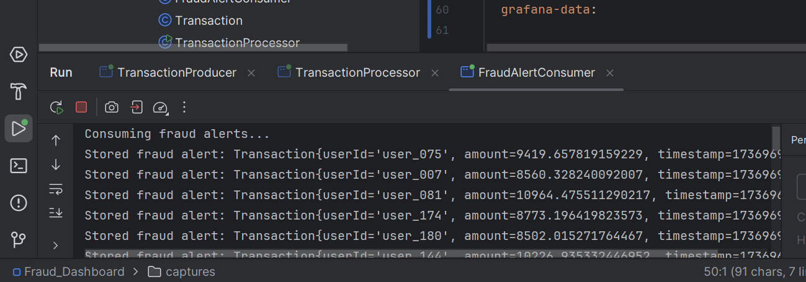
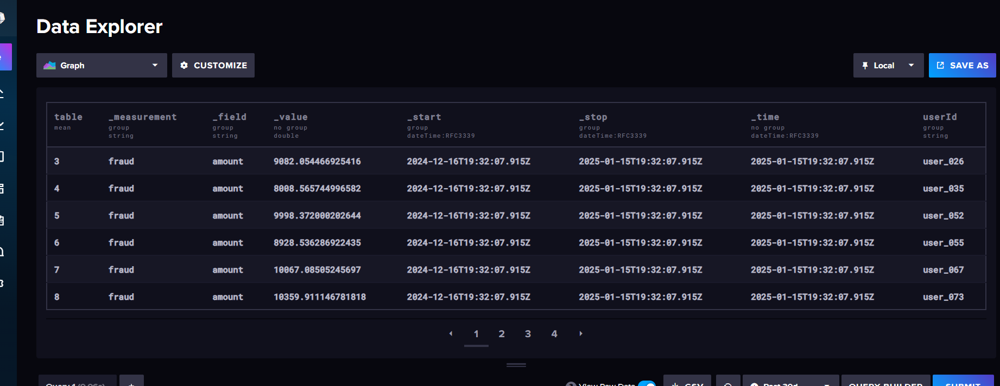

# Détection de Fraudes avec Kafka Streams

Ce projet a pour objectif de mettre en place une solution de détection de transactions financières suspectes en temps réel, en s'appuyant sur la technologie Kafka Streams. Les données identifiées comme frauduleuses sont ensuite conservées dans une base de données, et l'ensemble des informations sont visualisées via un tableau de bord Grafana.

## Résultats

#### 1- Création des topics

### 2- Transaction Producer

### 3- Transaction Consumer

### 4- Transaction Processor

### 5- Visualisation des données dans Influx

### 6- Visualisation des données dans Graphana

